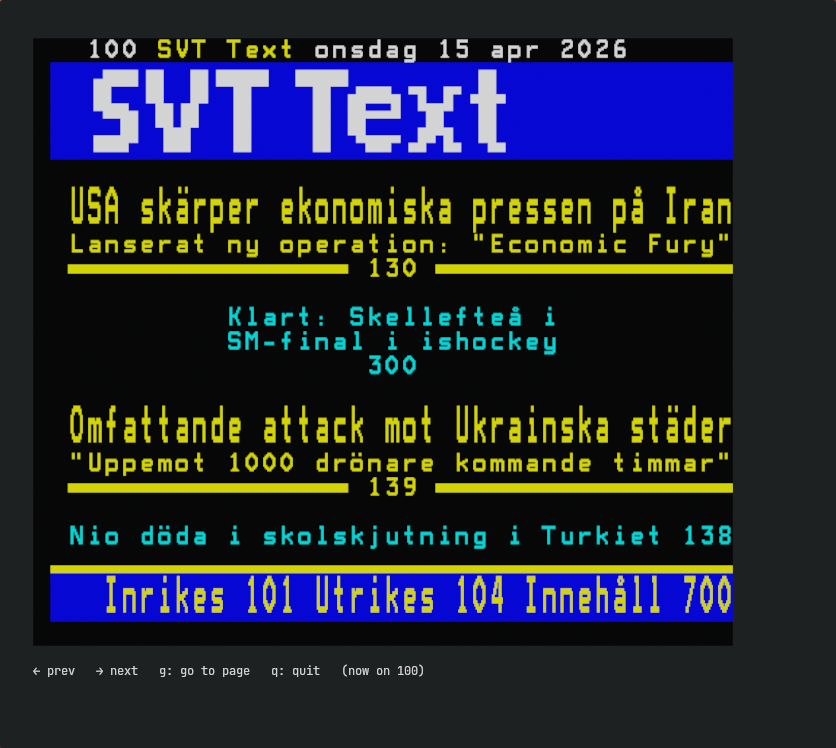
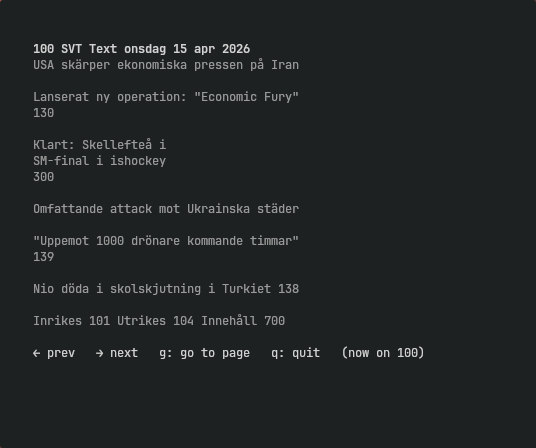

# Swedish Text TV in the Terminal

A simple and fast terminal client for browsing Swedish Text TV — for us who prefer reading the news without launching a web browser.

This project is inspired by the now-unmaintained [txtv by voidcase](https://github.com/voidcase/txtv), which no longer works. 

<table>
  <tr>
    <td align="center"><strong>Image mode</strong></td>
    <td align="center"><strong>Text mode</strong></td>
  </tr>
  <tr>
    <td></td>
    <td></td>
  </tr>
</table>

## Features
> 🗓️ Planned | ✅ Implemented
- Display text tv pages as images ✅
- Plaintext mode ✅

## Prerequisites

- [Kitty](https://sw.kovidgoyal.net/kitty/graphics-protocol/), [iTerm](https://iterm2.com/documentation-images.html) or [Sixel](https://github.com/saitoha/libsixel) graphics protocol is required to render full resolution images.

## Installation

### Cargo (requires [rust](https://rustup.rs/))

```sh
cargo install txtv
```

### Build from source (requires [rust](https://rustup.rs/))

```sh
# Clone the repository
git clone https://github.com/uherman/txtv.git
cd txtv

# Build and install (installs to ~/.cargo/bin/)
cargo install --path .

# Or build manually and copy to a folder of your choice
cargo build --release
cp target/release/txtv ~/path/to/bin/ # usually ~/.local/bin
```

## Usage

Open the interface by running the following command
```sh
txtv
```

Open a specific page
```sh
txtv 130
```

Use text mode (no image protocol required)
```sh
txtv --mode text
# or
txtv -m text
```

### Options

| Flag | Description |
|------|-------------|
| `-m, --mode <MODE>` | Render mode: `image` (default) or `text` |
| `-h, --help` | Print help |
| `-v, --version` | Print version |

### Controls

- **`←`** Go to previous page
- **`→`** Go to next page
- `g` Go to a specific page
- `q` Quit

