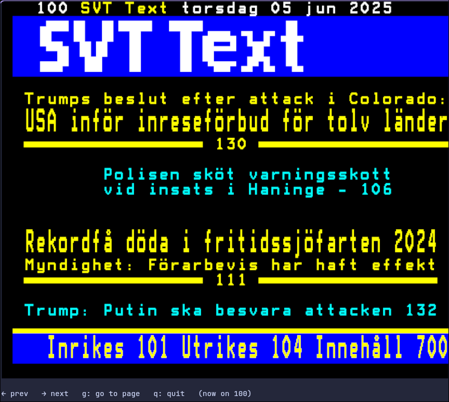

# Swedish text tv in the terminal

#### SV

För oss som vill läsa nyheterna utan att behöva öppna webbläsaren.

#### EN

For us who want to read the news without having to open the browser.


## Prerequisites

- [Kitty](https://sw.kovidgoyal.net/kitty/graphics-protocol/), [iTerm](https://iterm2.com/documentation-images.html) or [Sixel](https://github.com/saitoha/libsixel) graphics protocol is required to render full resolution images.

## Installation

More options coming soon.

### Build from source

```sh
$ git clone https://github.com/uherman/txtv.git
$ cd txtv
$ cargo build --release
$ cp target/release/txtv ~/path/to/bin # usually ~/.local/bin
```

## Usage

```sh
$ txtv
```


